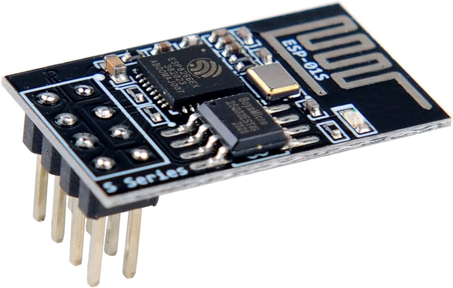

# Wi-Fi модуль ESP01S UART на базе ESP8266



Wi-Fi модуль ESP01S, основанный на микроконтроллере ESP8266, предназначен для подключения любых контроллеров к локальной сети по Wi-Fi через интерфейс UART. Это идеальное решение для проектов, требующих беспроводного соединения.

## Основные возможности модуля ESP01S

1. **Wi-Fi подключение**:
   - **Режим точки доступа (AP)**: Создание собственной Wi-Fi сети с фиксированным IP-адресом.
   - **Режим станции (STA)**: Подключение к существующей Wi-Fi сети.

2. **Передача данных**:
   - Обеспечивает обмен данными между HTTP и UART, позволяя подключить контроллер без встроенного Wi-Fi модуля к локальной сети.

3. **Сетевые параметры для режима точки доступа (AP)**:
   - **IP-адрес**: 192.168.1.1
   - **Шлюз**: 192.168.1.1
   - **Маска сети**: 255.255.255.0
   - **Web-сервер**: работает на порту 80

## Пример кода

Пример кода написан на языке C++ для платформы Arduino. SSID и пароли для подключения хранятся во внешнем файле `secret.ino`.

```cpp
// secret.ino
// for AP 
const char* ssid_AP = "yourAPSSID";  
const char* password_AP = "yourAPPassword";
// for STA
const char* ssid = "yourSSID";  
const char* password = "yourPassword";
```

Основной скетч:
```cpp
#include <ESP8266WiFi.h>

void setup() {
  Serial.begin(115200);
  WiFi.mode(WIFI_AP_STA);  // Режим точки доступа и станции

  // Настройка точки доступа (AP)
  WiFi.softAP(ssid_AP, password_AP);
  Serial.println("AP Mode: ");
  Serial.println(WiFi.softAPIP());

  // Подключение к Wi-Fi сети (STA)
  WiFi.begin(ssid, password);
  while (WiFi.status() != WL_CONNECTED) {
    delay(1000);
    Serial.println("Connecting to WiFi...");
  }
  Serial.println("Connected to WiFi");
  Serial.println(WiFi.localIP());
}

void loop() {
  // Ваш основной код
}
```

## Интеграция с GitHub
Для автоматического добавления изменений в репозиторий GitHub используется Python скрипт make.py. Токен доступа GitHub хранится во внешнем файле secret.py.

```python
# make.py
import os
import sys
from github import Github

# Загрузка токена GitHub из файла secret.py
from secret import tokenGit

def git_push(comment):
    g = Github(tokenGit)
    repo = g.get_user().get_repo('your-repo-name')
    repo.git.add(update=True)
    repo.git.commit(message=comment)
    repo.git.push()

if __name__ == "__main__":
    comment = sys.argv[1] if len(sys.argv) > 1 else "Update"
    git_push(comment)
```
```sh
# Для автоматческого добавление на GitHub
$ python make.py git "Комментарий"
```

# Технологии

- **Язык программирования**: C++
- **Статус проекта**: В разработке

# Автор

2024 Evgeny Goryachev
Gor.Com 
